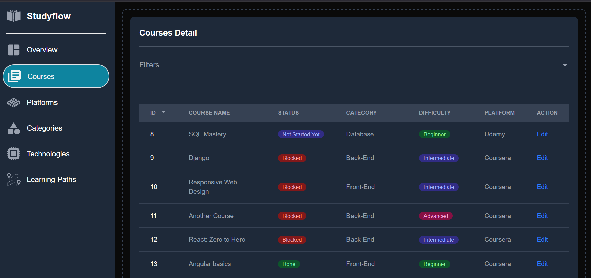
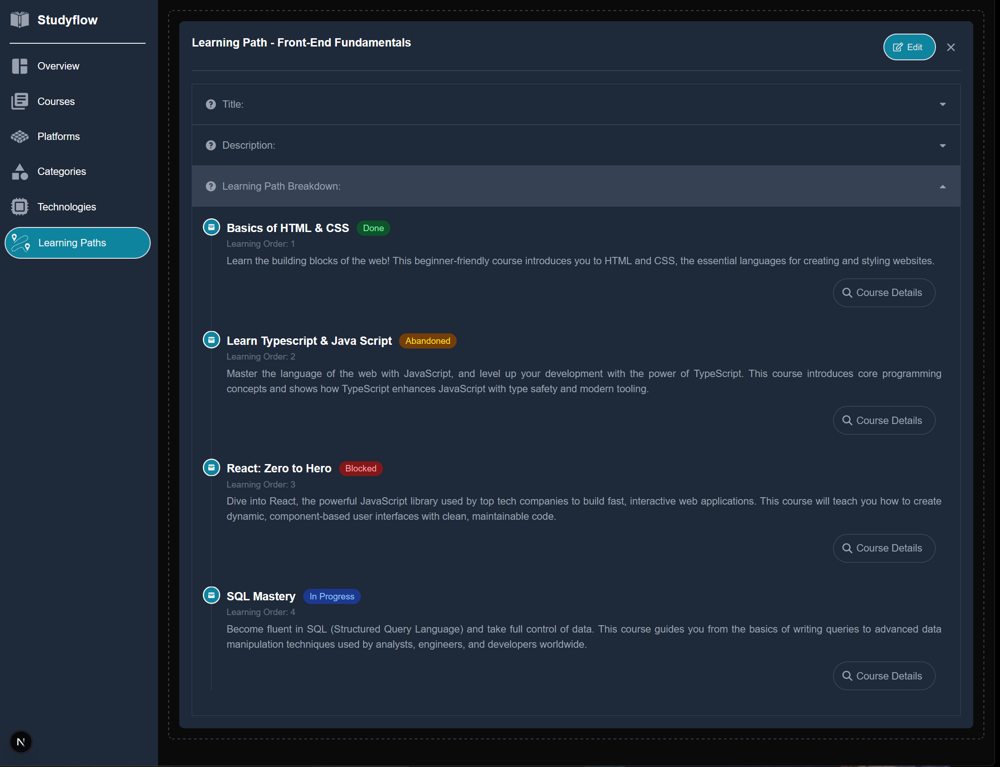
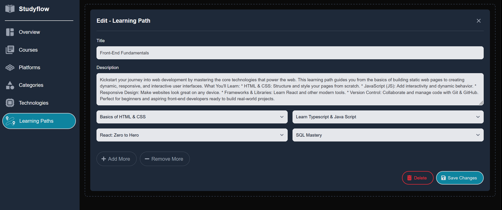
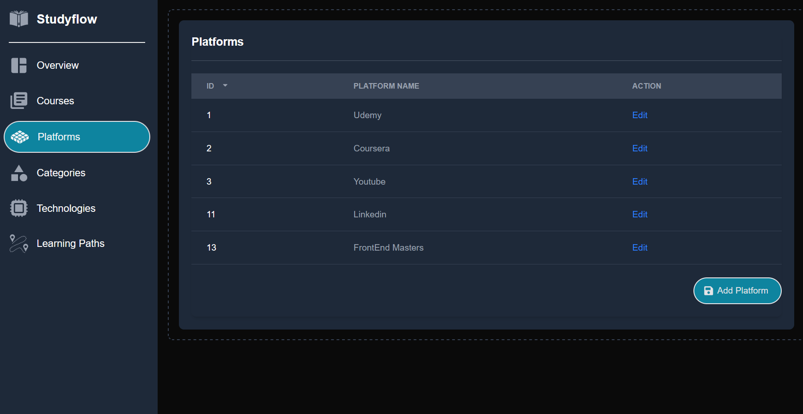
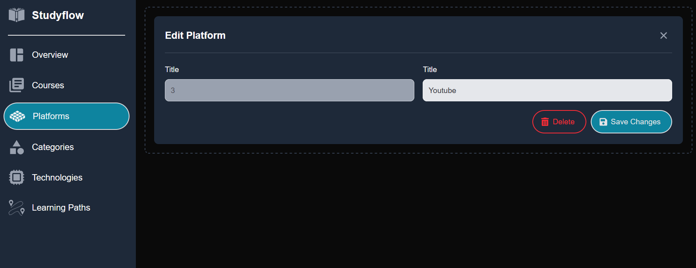

# StudyFlow
Keep tracks of your learning needs in one place! 

🔴🔴 IMPORTANT: That this app is still a work in progress 🔴🔴 

## Description
StudyFlow is a web application that allows users to add courses and keep track of their learning progress. Additionally, users can create a learning path and study each course based on that path.

## Table of Contents
- [Installation](#installation)
- [Usage](#usage)
- [Features](#features)
- [Contributing](#contributing)
- [License](#license)
- [Screenshots](#screenshots)

### Features
 - Creating a learning path (Done)
   - Based on available courses
   - Defining Learning Order
 - Adding / modifying / deleting courses, technologies, platforms, categories (Done)
 - Filtering courses based on: (Done)
   - Status
   - Difficulty
   - Priority
   - Platform
   - Categories
   - Technologies
 - User authentication (TBA)
 - Responsive layout(TBA)

### License
MIT

### Screenshots
Courses Page:

Courses Edit Page:

Learning Path Page:

Learning Path Edit Page:

Platforms Page: 

Platform detail page:

